# BML manual Start — control flow research

**Repo:** Cursor Usage Meter  
**Date:** 2026-08-04  
**Scope:** How the Meter BML UI starts (or fails to start) the skill chain manually, from button → panel → IPC → `coach.runAllSkillSteps`. Primary sources only (this repo).

---

## Executive summary

The **committed** design (9173c0b → a2ae6c9 → 10a8dfb) opens the BML panel idle and starts the chain only via the footer **Start** button (`#bmlRun`) or a chain-line click. That path is wired end-to-end through IPC to `runAllSkillSteps`.

**Resolved (2026-08-04):** An intermediate WIP had added an unwired header `#bmlStart` and demoted `#bmlRun` to hidden "Copy next". That was reverted/fixed in `a2ae6c9` (footer `#bmlRun` labeled **Start**, disabled until a project is selected) and `10a8dfb` (dial `#bmlBtn` calls `setPanelOpen` only; restyled as navigation).

---

## Resolution log

| Issue from this note | Fix commit | Status |
|----------------------|------------|--------|
| Header `#bmlStart` disabled / no handler | a2ae6c9 — removed; use `#bmlRun` as Start | Done |
| `#bmlRun` labeled "Copy next" / hidden | a2ae6c9 — primary **Start**, visible when idle | Done |
| Start with no project | a2ae6c9 — `disabled` + status hint | Done |
| Dial BML looked like Start / might auto-run | 10a8dfb — open panel only + neutral style | Done |
| Panel focus for clicks | a2ae6c9 — `focus: true` on open | Done |

## 1. User-visible controls and what each does

| Control | Location | Visible when | Wired in `renderer.js`? | Effect |
|---------|----------|--------------|-------------------------|--------|
| **BML** (`#bmlBtn`) | Dial footer bar | Always | Yes | Toggles panel open/closed via `togglePanel()` → IPC `bml:togglePanel`. **Does not start the chain** (`autoProcess: false`). |
| **Project dropdown** (`#bmlProjectSelect`) | Panel header | Panel open | Yes | `setSelectedProject(cwd)` → persists `selectedProjectCwd`, resets chain to step 0. Required before inject. |
| **Start** (`#bmlStart`) | Panel header | Panel open | **No** | HTML `disabled` always. **No click handler. Does nothing.** *(Uncommitted WIP only.)* |
| **Start / Copy next** (`#bmlRun`, committed) | Panel footer, primary | Panel open, not `awaitingConfirm` | Yes | `runSkillStep()` → IPC `bml:runSkillStep` → **`runAllSkillSteps`** (full chain from step 0). |
| **Copy next** (`#bmlRun`, working tree) | Panel footer, ghost, `hidden` in HTML | JS sets `hidden = awaiting`; unhidden when idle | Yes (same handler) | Same IPC as above — still starts **full chain**, despite label. |
| **Chain line** (`#bmlChain li`) | Build section | Panel open | Yes | `runOneSkillStep(index)` → **`runSkillStep(index, { continueChain: false })`** — single skill only. |
| **Continue / Next now** (`#bmlConfirm`) | Panel footer | `awaitingConfirm === true` | Yes | `confirmInjectedStep({ continueChain: true })` — marks step done, runs next skill. |
| **Cancel** (`#bmlCancel`) | Panel footer | `bmlBusy` or `runCost.running` or `canCancel` | Yes | `cancel()` — aborts inject + resets run state. |
| Measure / Learn controls | Later stages | Stage-gated | Yes | `postMeasure`, `recordLearn`, flag toggles — not chain start. |

### CONTEXT.md intent

```47:54:CONTEXT.md
**BML coach**:
The optional Meter panel that organizes Matt skills into a Build–Measure–Learn
chain for a **user-selected project** (dropdown in the BML header). The BML
button only opens the side panel; the user starts the chain with **Start /
Copy next** or by clicking a single skill line.
```

---

## 2. Control flow (manual full chain)

```mermaid
sequenceDiagram
  participant User
  participant Renderer as renderer.js
  participant Preload as preload.js
  participant Main as main.js
  participant Coach as coach.js
  participant Inject as inject.js

  User->>Renderer: Click BML (#bmlBtn)
  Renderer->>Preload: bml.togglePanel()
  Preload->>Main: IPC bml:togglePanel
  Main->>Main: applyPanelLayout(open, focus:false)
  Main->>Coach: togglePanel({ autoProcess: false })
  Coach->>Coach: setPanelOpen(true) → panel/open, return getView()
  Main->>Renderer: bml:state (panelOpen:true)
  Note over User,Coach: Panel idle — no inject

  User->>Renderer: Select project (#bmlProjectSelect)
  Renderer->>Preload: bml.setSelectedProject(cwd)
  Preload->>Main: IPC bml:setSelectedProject
  Main->>Coach: setSelectedProject(cwd)
  Coach->>Coach: project/select, reset chain, syncActiveProject

  User->>Renderer: Click Start / Copy next (#bmlRun)
  Renderer->>Renderer: bmlBusy guard
  Renderer->>Preload: bml.runSkillStep()
  Preload->>Main: IPC bml:runSkillStep
  Main->>Coach: runAllSkillSteps({ onProgress: publishBml })
  Coach->>Coach: ensureExperimentFromChatProject()
  Coach->>Coach: activeProject() — needs selectedProjectCwd
  loop Each skill 0..N-1
    Coach->>Coach: runSkillStep(i, { continueChain: true })
    Coach->>Inject: _inject → injectIntoCursor
    Inject-->>Coach: needsConfirm: true (clipboard path)
    alt CUM_BML_AUTO_CONTINUE default on
      Coach->>Coach: autoCompleteAfterInject (wait idle)
    else manual continue
      Coach-->>Main: return getView() paused
      User->>Renderer: Continue (#bmlConfirm)
      Renderer->>Coach: confirmInjectedStep
    end
  end
  Main->>Renderer: bml:state updates via publishBml
```



### Step-by-step with citations

#### A. Open panel (no chain start)

```298:298:src/renderer/renderer.js
bmlBtn?.addEventListener("click", async (e) => { e.stopPropagation(); applyBml(await bmlApi()?.togglePanel()); });
```

```195:203:src/main.js
  ipcMain.handle("bml:togglePanel", async () => {
    const opening = !bmlCoach?.getState()?.panelOpen;
    if (opening) applyPanelLayout(true, { focus: false });
    const view = await bmlCoach.togglePanel({
      autoProcess: false,
    });
    applyPanelLayout(view.panelOpen, { focus: false });
    publishBml(view);
    return view;
  });
```

```487:497:src/lib/bml/coach.js
    async setPanelOpen(open, opts = {}) {
      dispatch({ type: open ? "panel/open" : "panel/close" });
      if (!open) return getView();

      const prevCwd = boundCwd;
      const { changed, project } = syncActiveProject({ force: true });
      const onProgress =
        typeof opts.onProgress === "function" ? opts.onProgress : null;
      const autoProcess = opts.autoProcess === true;

      if (!autoProcess) return getView();
```

Commit **9173c0b** flipped `autoProcess` default from opt-out to **opt-in** (`=== true`) and set Meter IPC to `autoProcess: false`, so opening the panel never calls `runAllSkillSteps`.

#### B. Select project

```299:307:src/renderer/renderer.js
document.getElementById("bmlProjectSelect")?.addEventListener("change", async (e) => {
  e.stopPropagation();
  const cwd = e.target.value || null;
  try {
    applyBml(await bmlApi()?.setSelectedProject(cwd));
  } catch {
    // ignore
  }
});
```

```280:297:src/lib/bml/coach.js
  function activeProject() {
    const prefer = selectedCwd();
    if (!prefer) return null;
    try {
      return loadProjectAt(prefer, {
        sessionId: null,
        sessionLive: false,
        sessionSource: "user_selected",
        boundToChat: false,
      });
```

`selectedCwd()` resolves `CUM_BML_CWD` env override, then `state.selectedProjectCwd`.

#### C. Manual Start → `runAllSkillSteps`

```312:315:src/renderer/renderer.js
document.getElementById("bmlRun")?.addEventListener("click", async () => {
  if (bmlBusy) return; bmlBusy = true;
  try { applyBml(await bmlApi()?.runSkillStep()); } finally { bmlBusy = false; }
});
```

```45:45:src/preload.js
    runSkillStep: () => ipcRenderer.invoke("bml:runSkillStep"),
```

```227:227:src/main.js
  ipcMain.handle("bml:runSkillStep", async () => { const v = await bmlCoach.runAllSkillSteps({ onProgress: publishBml }); publishBml(v); return v; });
```

Note: IPC channel is named `runSkillStep` but main always calls **`runAllSkillSteps`** (full chain), not a single step.

```994:1005:src/lib/bml/coach.js
    async runAllSkillSteps(opts = {}) {
      const onProgress = typeof opts.onProgress === "function" ? opts.onProgress : null;
      cancelRequested = false;

      ensureExperimentFromChatProject();
      const project = activeProject();
      if (!project?.cwd) {
        return dispatch({
          type: "error",
          message: "Select a project in the BML dropdown to start.",
        });
      }
```

#### D. Single-skill path (chain line click)

```308:311:src/renderer/renderer.js
bmlChain?.addEventListener("click", (e) => {
  const li = e.target?.closest?.("li[data-step-index]");
  if (li && li.getAttribute("aria-disabled") !== "true") runSingleSkill(Number(li.dataset.stepIndex));
});
```

```228:228:src/main.js
  ipcMain.handle("bml:runOneSkillStep", async (_e, index) => { const v = await bmlCoach.runSkillStep(index, { trackCost: true, onProgress: publishBml, continueChain: false }); publishBml(v); return v; });
```

---

## 3. Conditions that prevent Start from working

### A. UI / wiring (current working tree)

| Condition | Symptom | Source |
|-----------|---------|--------|
| **`#bmlStart` always `disabled`, no handler** | Header Start never fires | ```56:64:src/renderer/index.html``` — no reference in `renderer.js` |
| **`#bmlRun` hidden in HTML** (working tree) | Primary committed control demoted; only unhidden by `applyBml` when not awaiting | ```77:85:src/renderer/index.html```, ```121:121:src/renderer/renderer.js``` |
| **`bmlBusy === true`** | Click ignored on `#bmlRun` / chain | ```312:314:src/renderer/renderer.js``` |
| **`awaitingConfirm === true`** | `#bmlRun` hidden; `#bmlConfirm` shown instead | ```113:121:src/renderer/renderer.js```, ```411:411:src/lib/bml/coach.js``` |
| **Chain lines `aria-disabled="true"`** | When `bmlBusy` or `awaiting` | ```150:150:src/renderer/renderer.js``` |

### B. Coach / state gates

| Condition | Error / behavior | Source |
|-----------|------------------|--------|
| **No project selected** (`selectedProjectCwd` null, no `CUM_BML_CWD`) | `lastError`: "Select a project in the BML dropdown to start." | ```998:1004:src/lib/bml/coach.js```, ```817:822:src/lib/bml/coach.js``` |
| **`autoProcess: false` on panel open** | Panel opens idle; no inject | ```495:497:src/lib/bml/coach.js```, ```198:199:src/main.js``` |
| **`autoProcess: true` without project** | Same select-project error | ```499:503:src/lib/bml/coach.js``` (CLI/tests path) |
| **`autoProcess: true` + stale `needsConfirm`** | Returns view without re-running | ```506:511:src/lib/bml/coach.js``` |
| **Persisted `lastInject.needsConfirm`** | Panel opens with Continue visible, Start hidden | State persisted in `bml-state.json` ```416:429:src/lib/bml/state.js``` |
| **Inject failure** (Accessibility, paste) | Error in status; chain may pause | ```306:316:src/lib/bml/inject.js``` |
| **`CUM_BML_AUTO_CONTINUE=0`** | After first inject, chain pauses for Continue | ```1147:1205:src/lib/bml/coach.js```, ```135:139:src/lib/bml/agent-idle.js``` |
| **Cancel in flight** | `cancelRequested` breaks loop | ```1070:1072:src/lib/bml/coach.js``` |

### C. Focus / mouse-event behavior (click blocking)

The overlay is designed to stay out of Cursor's way; panel interactions are mostly click-safe, with a few edge cases.

#### Window focus model

```135:136:src/main.js
    focusable: false,
    acceptFirstMouse: true,
```

```60:84:src/main.js
function applyPanelLayout(panelOpen, opts = {}) {
  ...
  // Do not steal focus after inject — Cursor Agent needs to keep the keyboard.
  const wantFocus = panelOpen && opts.focus === true;
  try {
    mainWindow.setFocusable(true);
    if (wantFocus) {
      mainWindow.focus();
      mainWindow.webContents.focus();
    } else if (!panelOpen) {
      setTimeout(() => {
        if (!mainWindow || mainWindow.isDestroyed() || bmlCoach?.getState()?.panelOpen) return;
        try { mainWindow.setFocusable(false); } catch {}
      }, 150);
    }
  } catch {}
```

- Window is created **`focusable: false`**.
- Opening BML sets **`setFocusable(true)`** but **`focus: false`** — panel accepts clicks without stealing focus from Cursor Agent.
- Closing panel (after 150ms) sets **`focusable: false`** again if panel stays closed.
- **`acceptFirstMouse: true`** allows the first click to register on an unfocused panel window (macOS panel type).

**Implication:** Clicks on BML controls should work without focusing the Meter; focus is not required for IPC. This is unlikely to block Start unless Electron panel + `focusable: false` regresses on a specific macOS build (not evidenced in code).

#### Drag vs click discrimination

```177:179:src/renderer/renderer.js
function isInteractiveTarget(target) {
  return Boolean(target?.closest?.("#bmlBtn, #bmlPanel, button, input, textarea, a, label, select"));
}
```

```262:269:src/renderer/renderer.js
window.addEventListener("pointerdown", (e) => {
  if (isInteractiveTarget(e.target)) return;
  ...
  e.target.setPointerCapture?.(e.pointerId);
});
```

- Clicks on **`#bmlPanel`**, all **`button`**, **`select`**, etc. skip window drag.
- **`#bmlBtn`** uses `e.stopPropagation()` on click.
- **`#meta`** (percent labels) has **`pointer-events: none`** ```54:54:src/renderer/styles.css``` — clicks pass through dial center to drag layer; does not affect panel buttons.

#### CSS / disabled state

- **`#bmlStart` `disabled` attribute** — native disabled buttons **do not emit click events**. This is the direct cause of the broken header Start in the working tree.
- **`body { cursor: grab }`** vs **`body.bml-open { cursor: default }`** ```11:20:src/renderer/styles.css``` — cosmetic only when panel open.

---

## 4. Recent commit: idle panel (9173c0b)

**Commit:** `9173c0b` — *Open the BML panel idle instead of auto-starting the skill chain.*

| File | Change |
|------|--------|
| `coach.js` | `autoProcess` now **opt-in** (`=== true`); early return when false |
| `main.js` | `bml:setPanelOpen` / `bml:togglePanel` pass **`autoProcess: false`** (was `true`) |
| `index.html` (committed) | BML btn title clarifies no auto-start; `#bmlRun` renamed **Start / Copy next** |
| `CONTEXT.md` | Documents manual start via Start/Copy next or chain line |
| `test/bml-project-switch.test.js` | Asserts panel open alone injects 0 times; `runAllSkillSteps` after `setSelectedProject` |

**Uncommitted WIP** (not in 9173c0b): adds `#bmlStart` (disabled, unwired), hides/demotes `#bmlRun` — **creates the broken header Start**.

---

## 5. Recommended smallest fix

**Goal:** A manual Start button that actually starts `runAllSkillSteps` when a project is selected.

### Option A — Wire the existing `#bmlStart` (minimal, matches WIP HTML)

1. In `renderer.js`, add `#bmlStart` click handler mirroring `#bmlRun`:
   - `applyBml(await bmlApi()?.runSkillStep())` with `bmlBusy` guard.
2. In `applyBml`, drive `#bmlStart.disabled`:
   - `disabled` when `!view.selectedProjectCwd` OR `bmlBusy` OR `view.awaitingConfirm` OR `view.runCost?.running`.
3. Remove `disabled` from static HTML (or leave; JS overrides `.disabled` property on each state push).

**Why this is smallest:** One button, one handler, reuses existing IPC `bml:runSkillStep` → `runAllSkillSteps`. No coach/main changes.

### Option B — Revert WIP HTML (restore 9173c0b footer control)

Revert uncommitted `index.html` changes so `#bmlRun` is again visible primary **Start / Copy next**. Already wired in `renderer.js`. User must still select a project first.

### Avoid

- Changing `autoProcess` back to `true` on panel open — contradicts 9173c0b product intent and CONTEXT.md.
- New IPC channel — `bml:runSkillStep` already maps to `runAllSkillSteps`.

### Verification checklist

1. Open BML → panel idle, no inject.
2. Without project → Start disabled; coach error if forced.
3. Select project → Start enabled.
4. Click Start → first inject, `awaitingConfirm` or auto-continue per env.
5. During run → Start disabled, Cancel visible.
6. After paste pause → Continue shown, Start hidden.

---

## Appendix: preload IPC surface (BML start-related)

```38:48:src/preload.js
    setPanelOpen: (open) => ipcRenderer.invoke("bml:setPanelOpen", open),
    togglePanel: () => ipcRenderer.invoke("bml:togglePanel"),
    ...
    runSkillStep: () => ipcRenderer.invoke("bml:runSkillStep"),
    runOneSkillStep: (index) => ipcRenderer.invoke("bml:runOneSkillStep", index),
    confirmInjectedStep: (payload) =>
      ipcRenderer.invoke("bml:confirmInjectedStep", payload || {}),
    ...
    setSelectedProject: (cwd) => ipcRenderer.invoke("bml:setSelectedProject", cwd),
```
